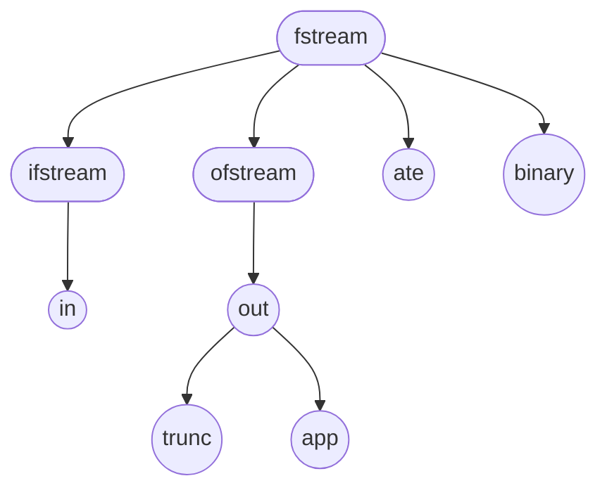

## 一、创建 IO 对象

### 1. IO 类与标准 IO 对象

一共有三大类 IO 类型：标准 IO、文件 IO、字符串 IO

其中标准 IO 的对象已经固定，只能使用：`cin`、`cout`、`cerr`或对应的宽字符版本。我们不需要创建新的`iostream`（包括`istream`、`ostream`以及`iostream`）类型的对象，只需要使用其指针或引用进行传递，且 IO 对象本身也不支持拷贝或赋值操作。

另外两种类型分别是：

- 文件 IO（头文件`fstream`）：`ifstream`、`ofstream`、`fstream`以及它们的宽字符版本
- 字符串 IO（头文件`sstream`）：`istringstream`、`ostringstream`、`stringstream`以及它们的宽字符版本

### 2. 文件 IO 的创建与使用逻辑

| 操作                             | 含义                                                         |
| -------------------------------- | ------------------------------------------------------------ |
| `stream_type s`                  | `stream_type`是`fstream`头文件中定义的一个类型 创建一个未绑定文件的文件流 |
| `stream_type s(file_name)`       | 创建一个文件流对象，并打开名为`file_name`的文件（可以是`string`类型或指向 C 风格字符串的指针） `explicit`的，文件使用默认文件模式打开，这取决于`stream_type`的具体类型 |
| `stream_type s(file_name, mode)` | 与上一个构造函数类似，但按指定`mode`打开文件                 |
| `s.open(file_name)`              | 打开名为`file_name`的文件，并将其与`s`绑定。文件使用默认模式打开 |
| `s.close()`                      | 关闭与`s`绑定的文件，返回`void`                              |
| `s.is_open()`                    | 返回一个`bool`值，指出与`s`关联的文件是否成功打开且尚未关闭  |

打开文件的操作可能失败，如果打开文件失败，流的`failbit`状态位会被置位。可以用流对象作为条件进行判断，如果没有发生错误则转换为`true`，如果发生错误则转换为`false`

如果要将文件流关联到另一个文件，必须首先关闭已经关联的文件。

****

**文件模式**：

所有的文件模式如下图所示，基本上是离散的，但部分有关系：

| 模式     | 含义                                  |
| -------- | ------------------------------------- |
| `in`     | 以读方式打开                          |
| `out`    | 以写方式打开（默认与`trunc`模式协同） |
| `trunc`  | 截断文件                              |
| `app`    | 每次写操作前均定位到文件末尾          |
| `ate`    | 打开文件后立即定位到文件末尾          |
| `binary` | 以二进制方式进行 IO                   |

- `ofstream`对象默认以`out`模式打开
- `out`模式只能对`ofstream`或`fstream`对象设定
- 设定为`out`模式时，则默认设定为`out`模式中的`trunc`模式；显式添加`app`模式可以避免默认按`trunc`模式打开，当使用`app`模式的时候可以省略`out`
- `trunc`模式和`app`模式不能共存
- `ifstream`对象默认以`in`模式打开
- `in`模式只能对`ifstream`或`fstream`对象设定
- 对于`fstream`对象，默认按`in | out`模式打开
- 按`in | out`模式打开的文件流不会截断文件

### 3. string 流的创建与使用逻辑

| 操作                 | 含义                                                         |
| -------------------- | ------------------------------------------------------------ |
| `stream_type s`      | `stream_type`是一种字符串流类型。 `s`是一个未绑定的字符串流 |
| `stream_type s(str)` | `s`是一个字符串流对象，保存`string str`的一个拷贝 `explicit`的 |
| `s.str()`            | 返回`s`所保存的`string`的拷贝                                |
| `s.str(str)`         | 将`string str`拷贝到`s`中，返回`void`                        |

- 需要注意的是字符串流本身包含一个`string`类型的对象，所以即便不绑定字符串也可以向其中进行写入，最后可以通过`s.str()`得到写入的结果
- 如果是输入流，那么就需要先拷贝一个需要读取的字符串进去，否则就没有内容进行读取
- 整个字符串流的使用都是用的流内部的`string`对象，而非将某个外部的`string`对象绑定到其上，所以读取操作并不是从某个外部`string`对象进行读取，写入操作也不是直接写入到某个外部`string`对象。整个读写过程不会对外部的`string`对象产生任何影响，除非对其进行赋值。

## 二、基本操作

### 1. 格式化读写

| 操作               | 含义                                                      |
| ------------------ | --------------------------------------------------------- |
| `is >> obj`        | 从输入流`is`读取数据并赋值给`obj`。返回输入流`is`的引用   |
| `os << val`        | 将值`val`写入到输出流`os`。返回输出流`os`的引用           |
| `getline(is, str)` | 从输入流`is`读取一行字符串保存到给定的`string`对象`str`中 |

### 2. 未格式化 IO

未格式化 IO 是以字节为单位进行读写操作的，支持的操作如下：

- 单字节操作

  | 操作             | 效果                                                 |
  | ---------------- | ---------------------------------------------------- |
  | `is.get(ch)`     | 从`istream is`读取下一个字节存入字符`ch`中。返回`is` |
  | `os.put(ch)`     | 将字符`ch`输出到`ostream os`，返回`os`               |
  | `is.get()`       | 将`is`的下一个字节作为`int`返回                      |
  | `is.putback(ch)` | 将字符`ch`放回`is`。返回`is`                         |
  | `is.unget()`     | 将`is`向后移动一个字节。返回`is`                     |
  | `is.peek()`      | 将下一个字节作为`int`返回，但不从流中删除它          |

  - `peek`不会移动`is`的位置，如果使用`peek`得到了`is`中的下一个字节，那么下一次使用`is`读取仍然是从该处开始
  - `unget`使流`is`向后（左）移动 1 个字节
  - `putback`将字符退回`is`，并使`is`下一次从该位置开始读取

  > 一般情况下，标准库保证我们可以退回最多一个值。即，标准库不保证在中间不进行读取操作的情况下能连续调用`putback`或`unget`

- 多字节操作

  | 操作                               | 效果                                                         |
  | ---------------------------------- | ------------------------------------------------------------ |
  | `is.get(sink, size, delim)`        | 从`is`中读取最多`size`个字节，并保存在字符数组`sink`中。 读取过程直至遇到字符`delim`或读取了`size`个字节或遇到文件尾时停止。 如果遇到了`delim`，则将其留在输入流中，不读取出来存入`sink` |
  | `is.getline(sink, size, delim)`    | 与接受三个参数的`get`版本类似，但会读取并丢弃`delim`         |
  | `is.read(sink, size)`              | 读取最多`size`个字节，存入字符数组`sink`中，返回`is`         |
  | `is.gcount()`                      | 返回上一个未格式化读取操作从`is`读取的字节数                 |
  | `os.write(source, size)`           | 将字符数组`source`中的`size`个字节写入`os`。返回`os`         |
  | `is.ignore(size = 1, delim = EOF)` | 读取并忽略最多`size`个字符，包括`delim`。                    |

  - 需要注意的是`gccount`调用之前如果使用了`peek`、`unget`或`putback`，则`gcount`返回 0

## 三、条件状态

每种特定的 IO 类型内都有另一个内置类型，用于标志流的状态：

- 类型：`stream_type::iostate`。`stream_type`是某种特定的流类型，`iostate`就是用于保存流状态的类型。每个特定类型的流对象中有一个这种类型的子对象，用于保存当前流的状态。
- 常量（位模式）
  - `stream_type::badbit`：`badbit`置位表示流已崩溃，否则为 0
  - `stream_type::failbit`：`failbit`置位表示一个 IO 操作失败了，否则为 0
  - `stream_type::eofbit`：`eofbit`置位表示流到达了文件结束，否则为 0
  - `stream_type::goodbit`：`goodbit`若置位，表示发生了某种错误，否则为 0
- 返回当前流状态的函数（`s`是一个流对象）：
  - `s.eof()`：当流`s`的`eofbit`置位时，返回`true`
  - `s.fail()`：当流`s`的`failbit`置位时，返回`true`
  - `s.bad()`：当流`s`的`badbit`置位时，返回`true`
  - `s.good()`：当流`s`没有任何标志位被置为时，返回`true`
- 状态控制函数
  - `s.clear()`：将流`s`的所有条件状态位复位，返回`void`
  - `s.clear(flags)`：根据给定的`flags`标志位，将流`s`中对应条件状态位复位。`flags`的类型必须是`stream_type::iostate`。返回`void`
  - `s.setstate(flags)`：根据给定的`flags`标志位，将流`s`中对应条件状态位置位。`flags`的类型必须是`stream_type::iostate`。返回`void`
  - `s.rdstate()`：返回流`s`的当前条件状态。返回值类型为`stream_type::iostate`

## 四、输出缓冲

需要输出和输入的内容都会先保存到输出流对象和输入流对象的缓冲区中，然后在某个条件下，输出流或输入流对象会将缓冲区刷新到实际的设备（文件）和变量中。

对于输入流，通常是将用户输入的一行内容保存到输入缓冲，然后在执行输入操作的时候将缓冲区的内容保存到变量中。输入流从用户输入到保存到实际变量通常是在同一条语句中完成，所以不需要特别考虑。唯一需要注意的是输入流在输入操作完成或因为错误导致输入停止的时候，输入流缓冲区仍保存有字符的情况。

而对于输出流，将需要输入的内容保存到缓冲区并将缓冲区的内容刷新到实际的设备或文件中的操作就通常不是在单个语句中同时完成的了。基于效率考虑，可能会将多个输出语句先保存到缓冲区，当缓冲区满了的时候再统一将内容刷新到实际的设备或文件中。如果在这期间出现了错误，那么在错误点之前的输出语句可能正常执行了，但却并没正常输出。另外，对于输出操作中间穿插输入操作的时候，通常也需要先将输入操作之前的内容全部输出给用户。

****

实际导致缓冲刷新的原因如下：

- 程序正常结束，作为`main`函数的`return`操作的一部分，缓冲刷新被执行

- 缓冲区满时，需要刷新缓冲，而后新的数据才能继续写入缓冲区

- 我们可以使用操纵符如`endl`显式刷新缓冲区

- 我们可以用操纵符`unitbuf`设置流的内部状态，使其后续输出操作都是立即刷新；或使用操纵符`nounitbuf`使其后续输出操作恢复正常的系统管理的缓冲区刷新机制

  > 默认情况下，`cerr`是设置为`unitbuf`的

- 一个输出流可能被关联到另一个流。在这种情况下，当读写被关联的流时，关联到的流的缓冲区会被刷新。

  > 默认情况下，`cin`和`cerr`都关联到`cout`

****

**操纵符**：

- `endl`：插入换行符并刷新缓冲区
- `flush`：不插入任何额外的字符，直接刷新缓冲区
- `ends`：插入空字符并刷新缓冲区
- `unitbuf`：设置流的状态为立即刷新，后续对该流对象的所有输出都在输出完成后立即刷新缓冲区
- `nounitbuf`：设置流的状态恢复正常的系统管理的缓冲区刷新机制

**关联流对象**：

使用`tie`函数来管理一个流对象的关联流对象：

- `s.tie()`：返回指向输出流的指针。如果`s`关联到一个输出流，则返回指向这个输出流的指针；否则返回空指针
- `s.tie(*os)`：接受一个指向`ostream`的指针，`s`将关联到这个`os`对象。可以传入`nullptr`用于解开`s`和与其关联的`ostream`对象

## 五、格式控制

**格式控制操纵符**：

接受参数的操纵符都定义在头文件`<iomanip>`中

- `bool`值

  - `boolalpha`、`noboolalpha`：将`bool`值打印为`true`或`false`而不是整数

- 整数值

  - `hex`、`oct`、`dec`：将整数按十六进制、八进制、十进制打印。默认为十进制，十六进制`a ~ f`按小写打印
  - `setbase(b)`：将整数输出设置为`b`进制
  - `showbase`、`noshowbase`：开启后按十六进制和八进制打印的整数会有前导字符，十六进制为`0x`，八进制为`0`。

- 浮点值

  - `setprecision(n)`：设置精度为`n`，默认精度为 6。在`defaultfloat`下精度指有效数字个数，`scientific`、`fixed`、`hexfloat`下精度指小数点后的数字位数
  - `scientific`、`fixed`、`hexfloat`、`defaultfloat`：浮点数按照科学计数法、定点十进制、十六进制计数法或默认计数法打印。十六进制计数法是以`p`为底的科学计数法。十六进制数、`e`、`p`都按小写打印。默认计数法会根据浮点数的值选择打印成定点十进制或科学计数法形式，标准库会选择一种可读性更好的格式
  - `showpoint`、`noshowpoint`：默认情况下为`noshowpoint`，即当小数部分为 0 时，不显示小数点。启用`showpoint`后，强制打印小数点。且会强制在小数部分后端补 0 到精度位

- 格式字符

  - `uppercase`、`nouppercase`：开启后十六进制`A ~ F`按大写打印。如果整数打印时同时开启了`showbase`，那么十六进制前导字符打印为`0X`。如果打印浮点数时使用科学计数法，其中的`e`或`p`按大写形式打印

  - `setw`、`left`、`right`、`internal`、`setfill`

    - `setw(n)`、`setfill(c)`：

      `setw(n)`指定下一个数字或字符串值的最小空间，如果被打印字符数小于这个设定值，默认填充空格并右对齐。注意只对下一个要输出的内容有效

      `setfill(c)`用字符`c`代替默认的空格来补白输出

    - `left`、`right`、`internal`

      `left`表示左对齐输出、`right`表示右对齐输出（默认）。

      `internal`：它左对齐符号，右对齐值

  - `noskipws`、`skipws`：开启`noskipws`则输入运算符会读取空白符而不是跳过它们。默认为`skipws`

  - `showpos`、`noshowpos`：开启`showpos`则会在正数前添加`+`号，默认为`noshowpos`

  

**格式控制成员函数**：

- `precision()`、`precision(n)`：前者返回当前精度值，默认为 6。后者接受一个`int`值，将精度设置为此值，并返回旧精度值

## 六、流随机访问

各种流类型通常都支持对流中数据的随机访问，通过重定位操作来进行。

标准库为所有流类型都定义了`seek`和`tell`函数，但它们是否会做有意义的事情依赖于流实际绑定到的设备或文件。在大多数系统中，绑定到`cin`、`cout`、`cerr`和`clog`的流不支持随机访问。

| 操作                                             | 效果                                                         |
| ------------------------------------------------ | ------------------------------------------------------------ |
| `is.tellg()` `os.tellp()`                   | 返回一个输入流中（`tellg`）或输出流中（`tellp`）标记的当前位置 |
| `is.seekg(pos)` `os.seekp(pos)`             | 在一个输入流或输出流中将标记重定位到给定的绝对地址。`pos`通常是前一个`tellg`或`tellp`返回的值 |
| `os.seekp(off, from)` `is.seekg(off, from)` | 在一个输入流或输出流中将标记定位到`from`之前或之后`off`个字符。`from`可以是下列值之一： - `beg`，偏移量相对于流开始位置 - `cur`，偏移量相对于流当前位置 - `end`，偏移量相对于流结尾位置 |

- `tell`函数返回的类型以及`seek`函数接受的参数`pos`或`off`的类型都是`pos_type`类型，属于调用它的流类型
- `off`的值可以是负的，表示向后（左）移动
- 如果输出流写入位置不在文件尾，那么输出流在输出操作时将改写原有内容而非添加新内容
