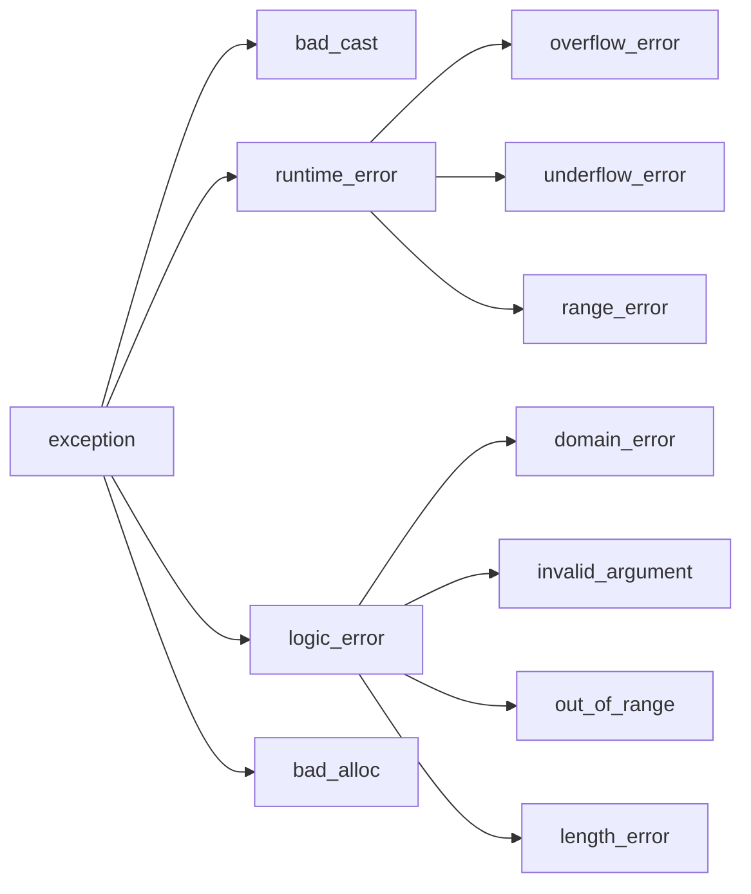

## 一、标准异常类

C++ 标准库定义了一组异常类，他们分散在 4 个头文件中：

- `exception`头文件定义了最通用的异常类`exception`。它只报告异常的发生，不提供任何额外信息，故不支持默认初始化外的其他初始化方式

- `stdexcept`头文件定义了几种常用的异常类：

  | 异常类             | 说明                                                   |
  | ------------------ | ------------------------------------------------------ |
  | `exception`        | 最常见的问题。和`exception`头文件中的`exception`类相同 |
  | `runtime_error`    | 运行时错误（通用）                                     |
  | `range_error`      | 运行时错误：生成的结果超出了有意义的值域范围           |
  | `overflow_error`   | 运行时错误：计算上溢                                   |
  | `underflow_error`  | 运行时错误：计算下溢                                   |
  | `logic_error`      | 程序逻辑错误（通用）                                   |
  | `domain_error`     | 逻辑错误：参数对应的结果值不存在                       |
  | `invalid_argument` | 逻辑错误：无效参数                                     |
  | `length_error`     | 逻辑错误：试图创建一个超出该类型最大长度的对象         |
  | `out_of_range`     | 逻辑错误：使用一个超出有效范围的值                     |

- `new`头文件定义了`bad_alloc`异常类型，不支持非默认初始化方式

- `type_info`头文件定义了`bad_cast`异常类型，不支持非默认初始化方式

> - 我们只能以默认初始化的方式初始化`exception`、`bad_alloc`、`bad_cast`对象，不允许为这些对象提供初始值
> - 其他异常类型的行为则恰好相反：应该使用`string`对象或 C 风格字符串初始化这些类型的对象，但是不允许使用默认初始化的方式。
> - 所有异常类型都有且只有一个名为`what`的成员函数，该函数不需要接受任何参数，返回值是一个指向 C 风格字符串的`const char*`。如果异常类型有一个字符串初始值，那么`what`返回该字符串。对于其他无初始值的异常类型来说，`what`返回的内容由编译器决定。

## 二、异常类层次

标准库异常类的继承体系如下图所示：

- `exception`仅仅定义了默认构造函数、拷贝构造函数、拷贝赋值运算符、一个虚析构函数和一个名为`what`的虚成员。
- `bad_cast`、`bad_alloc`定义了默认构造函数；`runtime_error`、`logic_error`没有默认构造函数，但是有一个可以接受 C 风格字符串或者`string`类型实参的构造函数

## 三、定义与使用自己的异常类

- 定义自己的异常类只需要使该类继承于某个标准异常类即可
- 使用自定义异常类的方式与使用标准异常类的方式完全一样