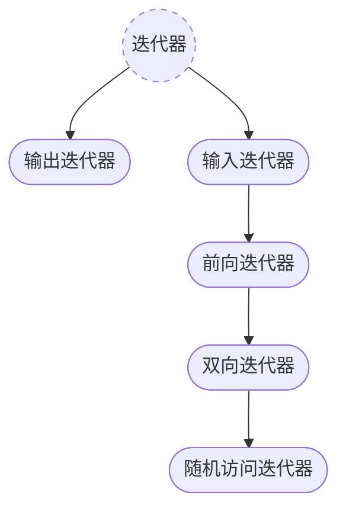

## 一、迭代器分类

`<iterator>`中不提供具体的迭代器类型，具体的迭代器类型通常是由一个容器自行定义的。根据迭代器支持的操作不同，可以分为 5 种迭代器，一共两大类，它们保持一种继承关系：



### 1. 输出迭代器

**必须支持的操作**：

- 用于推进迭代器的前置和后置递增运算（`++`）
- 解引用运算符（`*`），只出现在赋值运算符的左侧

> 只能向一个输出迭代器赋值一次。
>
> 不能保证输出迭代器的状态可以保存下来并用来访问元素。只能用于单遍扫描算法


### 2. 输入迭代器

**必须支持的操作**：

- 用于比较两个迭代器的相等和不相等运算符（`==`、`!=`）
- 用于推进迭代器的前置和后置递增运算（`++`）
- 用于读取元素的解引用运算符（`*`），只出现在赋值运算符的右侧
- 箭头运算符（`->`），解引用迭代器，并提取对象的成员

> 输入迭代器只用于顺序访问。
>
> 不能保证输入迭代器的状态可以保存下来并用来访问元素。只能用于单遍扫描算法


### 3. 前向迭代器

**必须支持的操作**：

- 支持所有输入和输出迭代器的操作
- 可以多次读写同一个元素，故可以保存其状态，用于多遍扫描


### 4. 双向迭代器

**必须支持的操作**：

- 支持前向迭代器的所有操作
- 支持前置和后置递减运算符（`--`），故可以进行双向扫描


### 5. 随机访问迭代器

**必须支持的操作**：

- 支持双向迭代器的所有功能
- 用于比较两个迭代器相对位置的关系运算符（`<`、`<=`、`>`、`>=`）
- 迭代器和一个整数值的加减运算（`+`、`+=`、`-`、`-=`）
- 用于两个迭代器上的减法运算符（`-`）
- 下标运算符`[]`


## 二、迭代器适配器

标准库迭代器中包括一些迭代器适配器和一些迭代器类模板用于快速得到需要的迭代器类型。

### 1. 插入迭代器（输出迭代器）

**插入迭代器类型**：

插入迭代器总共有三种类型（实际上是三个类模板）

- `std::back_insert_iterator<class Container>`：尾部插入迭代器，需要一个具体的容器类型进行实例化。
- `std::front_insert_iterator<class Container>`：头部插入迭代器，需要一个具体的容器类型进行实例化
- `std::insert_iterator<class Container>`：插入迭代器，需要一个具体的容器类型进行实例化

通常不直接使用这些复杂的类型名，而是直接使用`auto`替代，然后调用下面的辅助函数作为初始值。

**辅助函数**：

然后有三个返回特定容器内特定位置的对应类型的插入迭代器的函数（实际上是函数模板）：

- 返回对应类型尾部插入迭代器

  ```cpp
  template<class Container>				// 模板形参
  std::back_insert_iterator<Container>	 // 返回类型
  back_inserter(Container& c);
  ```

- 返回对应类型头部插入迭代器

  ```cpp
  template<class Container>				// 模板形参
  std::front_insert_iterator<Container>	 // 返回类型
  front_inserter(Container& c);
  ```

- 返回对应类型指定位置插入迭代器

  ```cpp
  template<class Container>				// 模板形参
  std::insert_iterator<Container>	 		 // 返回类型
  inserter(Container& c, typename Container::iterator i);
  ```

  `inserter`函数需要传入两个参数，第二个参数是对应容器实例中的一个迭代器，其指向容器中某个特定位置，使用插入迭代器将在此位置之前插入

上述函数在调用时，作为实参的容器必须要有对应的函数功能，`back_inserter`需要容器具有`push_back`成员；`front_inserter`需要容器具有`push_front`成员；`inserter`需要容器具有`insert`成员。

**操作**：

插入迭代器上的操作如下（`it`是一个插入迭代器）：

- `it = t`：在`it`指定的位置插入值`t`。如果是一个`insert_iterator`类型，则插入到迭代器所表示位置之前
- `*it`、`++it`、`it++`：存在但无效的操作。返回`it`


### 2. 流迭代器

流迭代器的主要用途是将流和泛型算法结合起来。

有两类流迭代器：`istream_iterator`、`ostream_iterator`。

这些迭代器将流当做一个特定类型的元素序列来处理。所以当使用流迭代器进行读写操作时，需要确保被读写的数据是同一类型的。

#### `istream_iterator`（输入迭代器）

| 操作                           | 含义                                                         |
| ------------------------------ | ------------------------------------------------------------ |
| `istream_iterator<T> in(is)`   | 输入流迭代器`in`从输入流`is`读取类型为`T`的值。<br />`T`要求实现了输入运算符 |
| `istream_iterator<T> end`      | 默认初始化，表示尾后位置。<br />当输入流迭代器指向的位置是一个 EOF 时，和这个位置相同 |
| `in1 == in2`<br />`in1 != in2` | 相等性判断。`in1`和`in2`必须是相同类型<br />如果它们都是尾后迭代器，或绑定到相同的输入流，则两者相等 |
| `*in`                          | 返回从流中读取的值                                           |
| `in->mem`                      | 与`(*in).mem`的含义相同                                      |
| `++in`、`in++`                 | 使用元素类型所定义的`>>`运算符从输入流中读取下一个值。<br />前置版本返回一个递增后迭代器的引用，后置版本返回旧值 |

需要注意的是读取操作实际发生的时间并不是对流迭代器解引用的时候，而是在此之前。

但是标准库也并不保证在将一个流迭代器绑定到一个流时就立即从流中读取数据，而是可以推迟到我们使用迭代器时才真正读取数据。但这个动作始终发生在解引用之前。

#### `ostream_iterator`（输出迭代器）

| 操作                             | 含义                                                         |
| -------------------------------- | ------------------------------------------------------------ |
| `ostream_iterator<T> out(os)`    | 输出流迭代器`out`将类型为`T`的值写入到输出流`os`中<br />`T`要求实现了输出运算符 |
| `ostream_iterator<T> out(os, d)` | `d`指向一个空字符结尾的字符数组。<br />`out`将类型为`T`的值写入到输出流`os`中，每个值后面都输出一个`d` |
| `out = val`                      | 用`<<`运算符将`val`写入到`out`所绑定的`ostream`对象中<br />`val`的类型必须与`out`可写的类型兼容 |
| `*out`、`++out`、`out++`         | 存在但无效。返回`out`                                        |

和输入流迭代器不同的是，实际的输出操作发生在`out = val`时


### 3. 反向迭代器（双向迭代器）

部分容器提供了自己的反向迭代器类型和返回反向迭代器的成员。其操作和双向迭代器相同，但含义发生了改变。

- 编程假定：通常以容器中末尾元素为`begin`，首前位置为`end`
- `++`、`--`：`++`操作移动到前一个元素，`--`操作移动到后一个元素

****

反向迭代器至少是一个双向迭代器，可以根据基本迭代器快速定义一个对应的反向迭代器类型。反向迭代器本身是一个类模板，接受一个基本迭代器类型作为模板参数：

```cpp
reverse_iterator<Iter>;
```

如果`Iter`的类型是双向迭代器，那么`reverse_iterator<Iter>`的类型也是双向迭代器；如果`Iter`是随机访问迭代器，那么`reverse_iterator<Iter>`也是随机访问迭代器。

如果反向迭代器是一个随机访问迭代器，那么它也支持以下操作，不过含义同样发生了改变：

- 关系比较：更大的底层迭代器意味着更小的逆向迭代器
- 与整数的加减操作：`it + n`表示将`it`向左移动`n`个元素；`it - n`表示将`it`向右移动`n`个元素
- 两个反向迭代器相减：靠左的迭代器减靠右的迭代器为正值

****

反向迭代器还提供一个操作：`base()`成员函数。

它返回反向迭代器对象的底层迭代器，这个底层迭代器的位置是指向该反向迭代器对象所指位置的后一个位置。


### 4. 移动迭代器

移动迭代器的类型是：`move_iterator<Iter>`，和反向迭代器一样，传入一个底层迭代器进行实例化。

但是获取移动迭代器通常采用`make_move_iterator(it)`函数，传入一个底层迭代器对象，返回一个指向同一位置的移动迭代器对象。

移动迭代器的**语义变化**在解引用操作上：对移动迭代器进行解引用操作将获得一个右值引用。