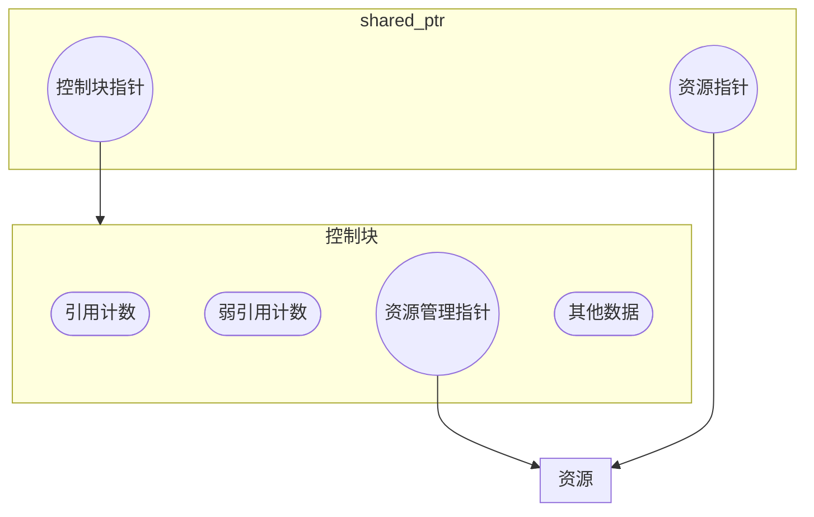
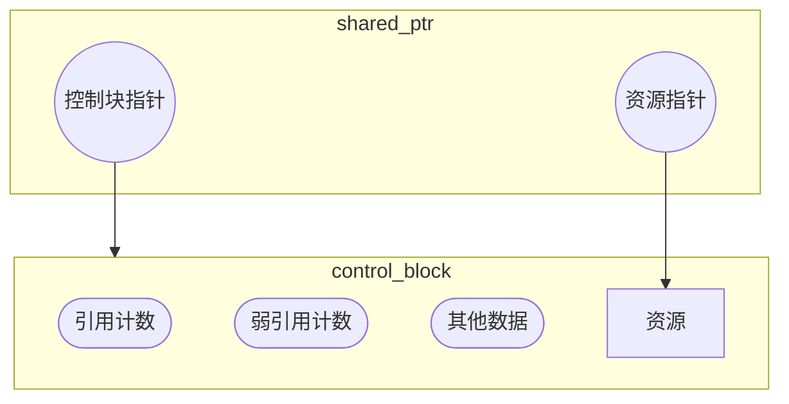

管理动态内存的智能指针类型一共 3 种：`shared_ptr`、`unique_ptr`、`weak_ptr`。它们都定义在`<memory>`头文件中

## 一、`shared_ptr`类

`shared_ptr`允许多个指针指向同一个对象。

它是一个类模板，创建`shared_ptr`指针时，需要提供其指向类型的信息。

### 1. 创建

#### 创建方法

**构造**

| 操作                      | 效果                                                         |
| ------------------------- | ------------------------------------------------------------ |
| `shared_ptr<T> sp`        | 空智能指针，可以指向类型为`T`的对象                          |
| `shared_ptr<T> sp(sq)`    | `sp`是`shared_ptr sq`的拷贝。此操作会递增控制块中的计数器。`q`中的指针必须能转换为`T*` |
| `shared_ptr<T> sp(sq, d)` | 和`shared_ptr<T> sp(sq)`的效果相同。但使用可调用对象`d`来代替`delete` |
| `shared_ptr<T> sp(u)`     | `sp`从`unique_ptr u`那里接管了对象的所有权；并将`u`置为空    |
| `shared_ptr<T> sp(q)`     | **explicit**的。`sp`管理内置指针`q`所指向的对象；`q`必须指向`new`分配的内存，且能够转换为`T*`类型 |
| `shared_ptr<T> sp(q, d)`  | 和`shared_ptr<T> sp(q)`的效果相同。但使用可调用对象`d`来代替`delete`用于释放资源 |

**实例创建函数**

| 操作                   | 效果                                                         |
| ---------------------- | ------------------------------------------------------------ |
| `make_shared<T>(args)` | 返回一个`shared_ptr`，指向一个动态分配的类型为`T`的对象。<br />使用`args`初始化此对象<br />传入的`args`需要和类型`T`的一个直接初始化方式（构造函数）匹配。如果不传递任何参数，则进行值初始化 |

#### 结构

综合来看，`shared_ptr`要么管理`new`表达式分配的内存，要么管理`make_shared`分配的内存（`unique_ptr`的情况暂不讨论），而它们之间并非完全相同，而是存在区别的。

如果管理`new`表达式分配的内存，那么实际的内存结构则类似于下面这个图：



而如果管理`make_shared`分配的内存，那么实际的内存结构则类似于下面这个图：



使用`make_shared`分配的内存会更紧凑，并且分配得到的资源不会被滥用。如果使用`new`表达式分配的内存，那么就需要保证后续不会再使用`new`所返回的指针去访问那块内存，而统一使用`shared_ptr`去管理。

#### 注意事项

- 如果将`new`分配的动态内存交给`shared_ptr`管理，就不要再使用`new`原来返回的指针了，包括所有指向同一个对象的指针
- 不要将指向同一块内存的基础指针用于初始化多个智能指针或为智能指针赋值


### 2. 操作

| 操作                                               | 效果                                                         |
| -------------------------------------------------- | ------------------------------------------------------------ |
| `p`                                                | `shared_ptr`对象。仍允许向`bool`的隐式转换                   |
| `*p`                                               | 解引用`p`，获得它所指的对象                                  |
| `p->mem`                                           | 等价于`(*p).mem`                                             |
| `p.get()`                                          | 返回`p`中保存的指针                                          |
| `swap(p, q)`<br />`p.swap(q)`                      | 交换`p`和`q`中的指针                                         |
| `p = q`                                            | `p`和`q`都是`shared_ptr`，所保存的指针必须能相互转换。<br />该操作会先递减`p`的引用计数，然后递增`q`的引用计数。 |
| `p.unique()`                                       | 若`p.use_count()`返回 1，则为`true`，否则返回`false`         |
| `p.use_count()`                                    | 返回与`p`共享对象的智能指针数量                              |
| `p.reset()`<br />`p.reset(q)`<br />`p.reset(q, d)` | `reset`会删除`p`对当前对象的引用，即使其引用计数递减，并将`p`置空；<br />若传递了可选的参数内置指针`q`，则令`p`接管`q`所指向的内存；<br />若还传递了参数`d`，则将用可调用对象`d`代替`delete` |


## 二、`unique_ptr`类

一个`unique_ptr`“拥有”它所指向的对象。和`shared_ptr`不同，某个时刻只能有一个`unique_ptr`指向一个给定对象。当`unique_ptr`被销毁时，它所指向的对象也被销毁。

### 1. 创建

| 操作                        | 效果                                                         |
| --------------------------- | ------------------------------------------------------------ |
| `unique_ptr<T> up`          | 空智能指针，可以指向类型为`T`的对象。使用`delete`释放资源，<br />和`unique_ptr<T> up(nullptr)`效果相同 |
| `unique_ptr<T> up(p)`       | **explicit**的，使`up`接管内置指针`p`所指向的内存，必须是动态分配的 |
| `unique_ptr<T, D> up(p)`    | **explicit**的，和`unique_ptr<T> up(p)`相同。但使用一个类型为`D`的可调用对象来释放资源，<br />其必须是默认可构造的且构造过程不抛出任何异常 |
| `unique_ptr<T, D> up(p, d)` | 和`unique_ptr<T, D> up(p)`相同。但使用类型为`D`的对象`d`而非默认构造的`D`类型对象 |

- `unique_ptr`不支持拷贝构造和赋值，但支持移动构造与赋值。
- `unique_ptr`没有类似`make_shared`的标准库函数返回一个`unique_ptr`。定义`unique_ptr`时，需要将其绑定到一个`new`返回的指针上


### 2. 操作

| 操作                                                  | 效果                                                         |
| ----------------------------------------------------- | ------------------------------------------------------------ |
| `p`                                                   | `unique_ptr`对象。仍允许向`bool`的隐式转换                   |
| `*p`                                                  | 解引用`p`，获得它所指的对象                                  |
| `p->mem`                                              | 等价于`(*p).mem`                                             |
| `p.get()`                                             | 返回`p`中保存的指针                                          |
| `swap(p, q)`<br />`p.swap(q)`                         | 交换`p`和`q`中的指针                                         |
| `u = nullptr`                                         | 释放`u`指向的对象，将`u`置为空                               |
| `u.release()`                                         | `u`放弃对指针的控制权，返回指针，并将`u`置为空               |
| `u.reset()`<br />`u.reset(q)`<br />`u.reset(nullptr)` | 释放`u`指向的对象<br />如果提供了内置指针`q`，令`u`指向这个对象；否则将`u`置为空 |


### 3. 管理数组的`unique_ptr`

基本用法和之前相同，区别是将实例化参数改为`Type[]`的形式，并且保证传入的内置指针是通过`new Type[size]`得到的，即：

```cpp
unique_ptr<Type[]> u(new Type[size]);
```

当使用`unique_ptr`管理动态数组时，`unique_ptr`提供了一个下标操作：

- `u[i]`：返回`u`拥有的数组中位置`i`处的对象。`u`必须指向一个数组


## 三、`weak_ptr`类

`weak_ptr`是一种不控制所指对象生存期的智能指针，它指向由一个`shared_ptr`管理的对象。

将一个`weak_ptr`绑定到一个`shared_ptr`不会改变`shared_ptr`的引用计数。一旦最后一个指向对象的`shared_ptr`被销毁，对象就会被释放。

| 操作                | 效果                                                         |
| ------------------- | ------------------------------------------------------------ |
| `weak_ptr<T> w`     | 空`weak_ptr`可以指向类型为`T`的对象                          |
| `weak_ptr<T> w(sp)` | 与`shared_ptr sp`指向相同对象的`weak_ptr`。`T`必须能转换为`sp`指向的类型 |
| `w = p`             | `p`可以是一个`shared_ptr`或一个`weak_ptr`。赋值后`w`与`p`共享对象 |
| `w.reset()`         | 将`w`置为空                                                  |
| `w.use_count()`     | 与`w`共享对象的`shared_ptr`的数量                            |
| `w.expired()`       | 若`w.use_count()`为 0，则返回`true`，否则返回`false`         |
| `w.lock()`          | 如果`expired`为`true`，返回一个空`shared_ptr`，否则返回一个指向`w`的对象的`shared_ptr` |

- `weak_ptr`并不能直接管理资源，如果需要通过`weak_ptr`管理资源，则需要通过`w.lock()`来得到实际管理资源的`shared_ptr`对象。

### 结构

`weak_ptr`看上去是直接指向资源的一个观察者，但实际上它应该指向`shared_ptr`创建的控制块。控制块中有一个**弱引用计数**，这个计数是所有指向同一个资源的`shared_ptr`和`weak_ptr`的数量总和。当**引用计数**归 0 时，实际资源被释放，而当弱引用计数归 0 时，控制块内存才被释放。

而当`shared_ptr`转而管理另一块资源时，通常是同时抛弃其所管理的控制块和资源，而`weak_ptr`直接管理控制块。所以即使用于初始化`weak_ptr`的那个`shared_ptr`不再管理这块资源时，`weak_ptr`并不会跟着这个`shared_ptr`的改变而改变。
